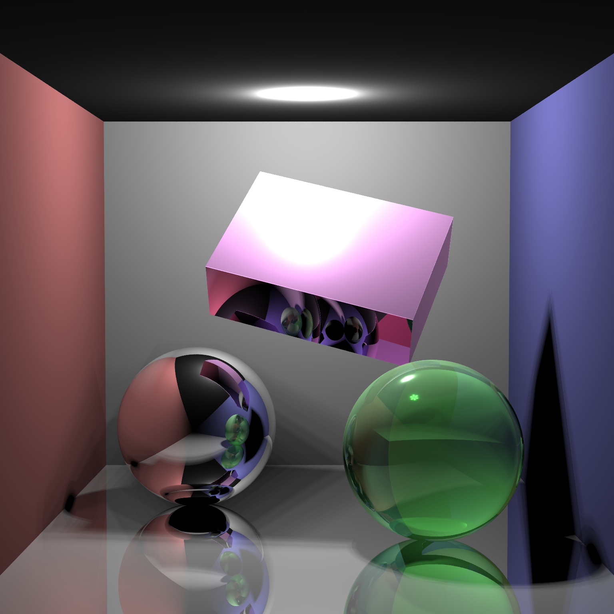
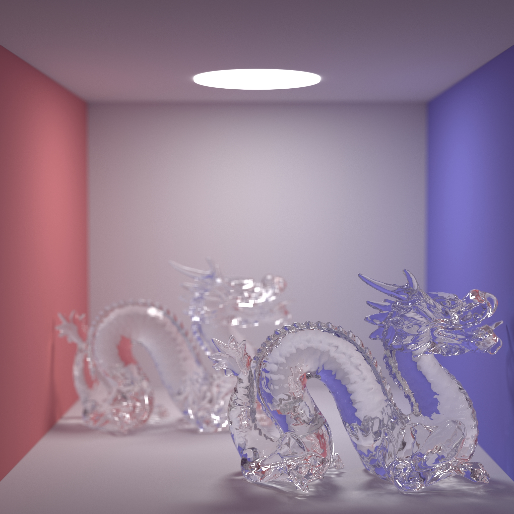

# Introduction

Course projects for Computer Graphics.

- PA0: Raster Graphics

- PA1: RayCasting

- PA2 OpenGL

- PA3 BezierSurface

- PA4: Jittor

# Final Project: Ray Tracer

## Functions

- Anti-aliasing
- Apertures
- Texture mapping
- Bezier surface

## Example Images

